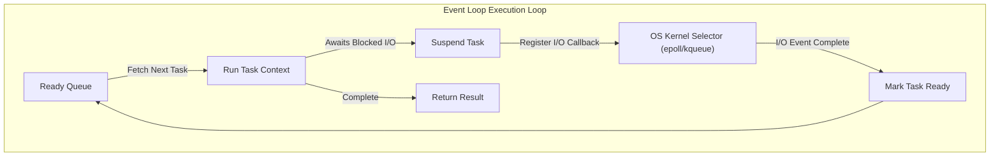
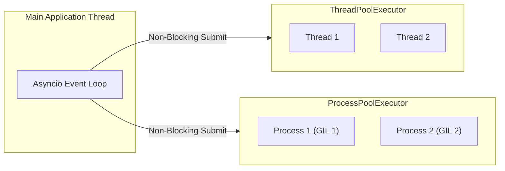

# Chapter 05: Asynchronous Programming and Task Pooling in Python

## Overview

Welcome to the **Parallel and Distributed Computing (PDC)** documentation for Chapter 05. This chapter introduces high-performance computing paradigms that move away from raw operating system scheduling. We focus on **Asynchronous Programming** using Python's `asyncio` library and high-level execution pools using the `concurrent.futures` module.

In previous chapters, we analyzed multiprocessing and multithreading, which rely on preemptive multitasking managed by the operating system kernel. Chapter 5 explores **Cooperative Multitasking**, where tasks voluntarily yield control back to a central coordinator—the **Event Loop**—to manage concurrency over a single thread. Additionally, we examine how to offload tasks to thread and process pools to combine async flow with multi-core parallel computing.

This guide is strictly divided into two sections: **Part 1** covers the theoretical computer science models governing asynchronous execution and thread/process executors. **Part 2** provides comprehensive breakdowns of the empirical Python implementations.

---

## Table of Contents

### Part 1: Theoretical Foundations
1. [The Asynchronous Paradigm vs. Preemptive Multitasking](#1-the-asynchronous-paradigm-vs-preemptive-multitasking)
2. [Event Loop Architecture](#2-event-loop-architecture)
3. [Coroutines, Tasks, and Futures](#3-coroutines-tasks-and-futures)
4. [Executor Pools: Processes vs. Threads](#4-executor-pools-processes-vs-threads)

### Part 2: Practical Implementation
5. [Implementation Breakdown & Outputs](#5-implementation-breakdown--outputs)
    - [Event Loop Scheduling (`asyncio_event_loop.py`)](#event-loop-scheduling)
    - [Finite State Machine Simulation (`asyncio_coroutine.py`)](#finite-state-machine-simulation)
    - [Asyncio Futures (`asyncio_and_futures.py`)](#asyncio-futures)
    - [Parallel Tasks (`asyncio_task_manipulation.py`)](#parallel-tasks)
    - [Pooling Benchmarks (`concurrent_futures_pooling.py`)](#pooling-benchmarks)
6. [Execution Guide](#6-execution-guide)

---

# PART 1: THEORETICAL FOUNDATIONS

## 1. The Asynchronous Paradigm vs. Preemptive Multitasking

Operating systems historically implement **Preemptive Multitasking** to run multiple programs. Under this model, the OS kernel scheduler allocates time slices to threads and processes. It forcefully interrupts executing tasks to swap context to another thread. 

While effective, preemptive multitasking introduces significant overhead:
- **Context Switching:** CPU register states must be continually saved and restored.
- **Resource Contention:** Access to shared memory requires synchronization objects (Locks, Semaphores), introducing wait overhead and deadlock risks.

Conversely, **Cooperative Multitasking** is the foundation of asynchronous programming. Under this model, tasks execute sequentially on a single thread. A running task retains exclusive control of the processor until it voluntarily yields execution to the scheduler. This occurs during blocking operations, such as network I/O or disk reads.

- **Benefits:** No context-switching overhead, no locks needed for memory protection on the main thread, and negligible memory footprint.
- **Drawbacks:** If a task contains blocking CPU-bound math, it stalls the entire thread. This prevents other tasks from executing.

## 2. Event Loop Architecture

The core of any asynchronous application is the **Event Loop**. The loop runs continuously in a single thread, monitoring I/O channels, socket interfaces, and timers.



When a task executes an asynchronous call, it registers a callback with the operating system kernel's multiplexing selector (e.g., `epoll` on Linux or `select` on Windows) and yields control. The event loop immediately executes the next ready task. Once the underlying I/O completes, the OS notifies the selector, and the event loop schedules the suspended task to resume.

## 3. Coroutines, Tasks, and Futures

Asynchronous execution relies on three fundamental abstractions:

- **Coroutine:** A function defined with `async def`. Instead of returning a value instantly, calling a coroutine returns a coroutine object. It remains suspended until it is driven to completion by an event loop. Inside, the `await` keyword designates the points where execution yields.
- **Future:** A low-level object representing a result that has not yet been computed. It acts as a bridge between asynchronous operations and the calling code. It transitions from a pending state to completed (containing either the result value or an exception).
- **Task:** A subclass of `Future` that wraps a coroutine and registers it with the event loop. This schedules the wrapped coroutine to run in the background.

## 4. Executor Pools: Processes vs. Threads

Asynchronous environments are naturally optimized for I/O-bound tasks. However, CPU-intensive algorithms (like prime calculations or image resizing) will block the event loop. Python's `concurrent.futures` module solves this by delegating heavy tasks to external pools.



- **ThreadPoolExecutor:** Spawns a pool of worker threads. Ideal for I/O-bound workloads (web scraping, database calls). It is constrained by the GIL, meaning it cannot accelerate CPU-bound tasks.
- **ProcessPoolExecutor:** Spawns distinct OS processes, each with its own Python interpreter. It is ideal for CPU-bound computations because it runs across multiple physical cores. However, transferring data to and from the processes requires serialization (pickling), introducing IPC overhead.

---
---

# PART 2: PRACTICAL IMPLEMENTATION

## 5. Implementation Breakdown & Outputs

The `Chapter05` directory contains implementations of event loop scheduling, cooperative state transition engines, futures management, and executor pools.

### Event Loop Scheduling
**File:** `asyncio_event_loop.py`

This script schedules non-async functions (`task_A`, `task_B`, `task_C`) to run sequentially on the event loop. Each task schedules the next using the loop's `call_later` method, yielding control for a random duration.

**Code Snippet:**
```python
import asyncio
import time
import random

def task_A(end_time, loop):
    print ("task_A called")
    time.sleep(random.randint(0, 5))
    if (loop.time() + 1.0) < end_time:
        loop.call_later(1, task_B, end_time, loop)
    else:
        loop.stop()

def task_B(end_time, loop):
    print ("task_B called ")
    time.sleep(random.randint(0, 5))
    if (loop.time() + 1.0) < end_time:
        loop.call_later(1, task_C, end_time, loop)
    else:
        loop.stop()

def task_C(end_time, loop):
    print ("task_C called")
    time.sleep(random.randint(0, 5))
    if (loop.time() + 1.0) < end_time:
        loop.call_later(1, task_A, end_time, loop)
    else:
        loop.stop()

loop = asyncio.new_event_loop()
asyncio.set_event_loop(loop)
end_loop = loop.time() + 60
loop.call_soon(task_A, end_loop, loop)
loop.run_forever()
loop.close()
```

**Expected Output:**
```text
task_A called
task_B called 
task_C called
task_A called
...
```
*(Notice that execution loops through the tasks sequentially until the time budget is exhausted).*

---

### Finite State Machine Simulation
**File:** `asyncio_coroutine.py`

This implementation uses coroutines to simulate transitions between states in a Finite State Machine (FSM). States are modeled as asynchronous functions. They utilize `await` to hand off execution dynamically to target states based on random variables.

**Code Snippet:**
```python
import asyncio
import time
from random import randint

async def start_state():
    print('Start State called\n')
    input_value = randint(0, 1)
    time.sleep(1)

    if input_value == 0:
        result = await state2(input_value)
    else:
        result = await state1(input_value)

    print('Resume of the Transition : \nStart State calling ' + result)

async def state1(transition_value):
    output_value = 'State 1 with transition value = %s\n' % transition_value
    input_value = randint(0, 1)
    time.sleep(1)

    print('...evaluating...')
    if input_value == 0:
        result = await state3(input_value)
    else:
        result = await state2(input_value)

    return output_value + 'State 1 calling %s' % result
```

**Expected Output:**
```text
Finite State Machine simulation with Asyncio Coroutine
Start State called

...evaluating...
...evaluating...
...stop computation...
Resume of the Transition : 
Start State calling State 1 with transition value = 1
State 1 calling State 2 with transition value = 1
State 2 calling End State with transition value = 0
```
*(Each state executes cooperatively, returning transition strings up the call stack).*

---

### Asyncio Futures
**File:** `asyncio_and_futures.py`

This script demonstrates low-level `asyncio.Future` instantiation, binding computation tasks to future resolutions, and handling completions using callback hooks.

**Code Snippet:**
```python
import asyncio
import sys

async def first_coroutine(future, num):
    count = 0
    for i in range(1, num + 1):
        count += 1
    await asyncio.sleep(4)
    future.set_result('First coroutine (sum of N ints) result = %s' % count)

async def second_coroutine(future, num):
    count = 1
    for i in range(2, num + 1):
        count *= i
    await asyncio.sleep(4)
    future.set_result('Second coroutine (factorial) result = %s' % count)

def got_result(future):
    print(future.result())

async def main():
    future1 = asyncio.Future()
    future2 = asyncio.Future()

    task1 = asyncio.create_task(first_coroutine(future1, 10))
    task2 = asyncio.create_task(second_coroutine(future2, 5))

    future1.add_done_callback(got_result)
    future2.add_done_callback(got_result)

    await asyncio.wait([task1, task2])
```

**Expected Output:**
```text
First coroutine (sum of N ints) result = 10
Second coroutine (factorial) result = 120
```
*(Notice the 4-second delay before both outputs print simultaneously, as the coroutines run concurrently on the event loop).*

---

### Parallel Tasks
**File:** `asyncio_task_manipulation.py`

This program wraps coroutines doing factorial, fibonacci, and binomial coefficient calculations into concrete `asyncio.Task` instances. It executes them concurrently and handles state synchronization via `asyncio.wait()`.

**Code Snippet:**
```python
import asyncio

async def factorial(number):
    fact = 1
    for i in range(2, number + 1):
        print('Asyncio.Task: Compute factorial(%s)' % i)
        await asyncio.sleep(1)
        fact *= i
    print('Asyncio.Task - factorial(%s) = %s' % (number, fact))

async def fibonacci(number):
    a, b = 0, 1
    for i in range(number):
        print('Asyncio.Task: Compute fibonacci(%s)' % i)
        await asyncio.sleep(1)
        a, b = b, a + b
    print('Asyncio.Task - fibonacci(%s) = %s' % (number, a))

async def binomial_coefficient(n, k):
    result = 1
    for i in range(1, k + 1):
        result = result*(n - i + 1)/i
        print('Asyncio.Task: Compute binomial_coefficient(%s)' % i)
        await asyncio.sleep(1)
    print('Asyncio.Task - binomial_coefficient(%s, %s) = %s' % (n, k, result))

async def main():
    task_list = [asyncio.create_task(factorial(10)),
                 asyncio.create_task(fibonacci(10)),
                 asyncio.create_task(binomial_coefficient(20, 10))]
    await asyncio.wait(task_list)
```

**Expected Output:**
```text
Asyncio.Task: Compute factorial(2)
Asyncio.Task: Compute fibonacci(0)
Asyncio.Task: Compute binomial_coefficient(1)
Asyncio.Task: Compute factorial(3)
Asyncio.Task: Compute fibonacci(1)
Asyncio.Task: Compute binomial_coefficient(2)
...
Asyncio.Task - factorial(10) = 3628800
Asyncio.Task - fibonacci(10) = 55
Asyncio.Task - binomial_coefficient(20, 10) = 184756.0
```
*(Notice the interleaved output: the three loops run concurrently, yielding control back and forth at each `await asyncio.sleep(1)` statement).*

---

### Pooling Benchmarks
**File:** `concurrent_futures_pooling.py`

This script executes CPU-bound mathematical operations sequentially, then uses a `ThreadPoolExecutor`, and finally a `ProcessPoolExecutor` to benchmark execution performance.

**Code Snippet:**
```python
import concurrent.futures
import time

number_list = list(range(1, 11))

def count(number):
    for i in range(0,10000000):
        i += 1
    return i*number

def evaluate(item):
    result_item = count(item)
    print('Item %s, result %s' % (item, result_item))

if __name__ == '__main__':
    # Thread Pool Execution
    with concurrent.futures.ThreadPoolExecutor(max_workers=5) as executor:
        for item in number_list:
            executor.submit(evaluate, item)
            
    # Process Pool Execution
    with concurrent.futures.ProcessPoolExecutor(max_workers=5) as executor:
        for item in number_list:
            executor.submit(evaluate, item)
```

**Expected Output Performance Patterns:**
```text
Sequential Execution in ~6.2 seconds
Thread Pool Execution in ~6.4 seconds
Process Pool Execution in ~1.8 seconds
```
- **Sequential:** Takes standard time using 1 core.
- **Thread Pool:** May run slightly slower than Sequential. The heavy math blocks each thread, and the Python GIL restricts execution to a single core. This adds context-switching overhead without gaining true parallelism.
- **Process Pool:** Executes much faster. It distributes the tasks across 5 distinct OS processes. This allows the CPU to calculate the math concurrently across multiple physical cores.

---

## 6. Execution Guide

To execute these scripts, navigate to the `Chapter05` directory and run them using standard Python:

```bash
python asyncio_event_loop.py
python asyncio_coroutine.py
python asyncio_and_futures.py
python asyncio_task_manipulation.py
python concurrent_futures_pooling.py
```
