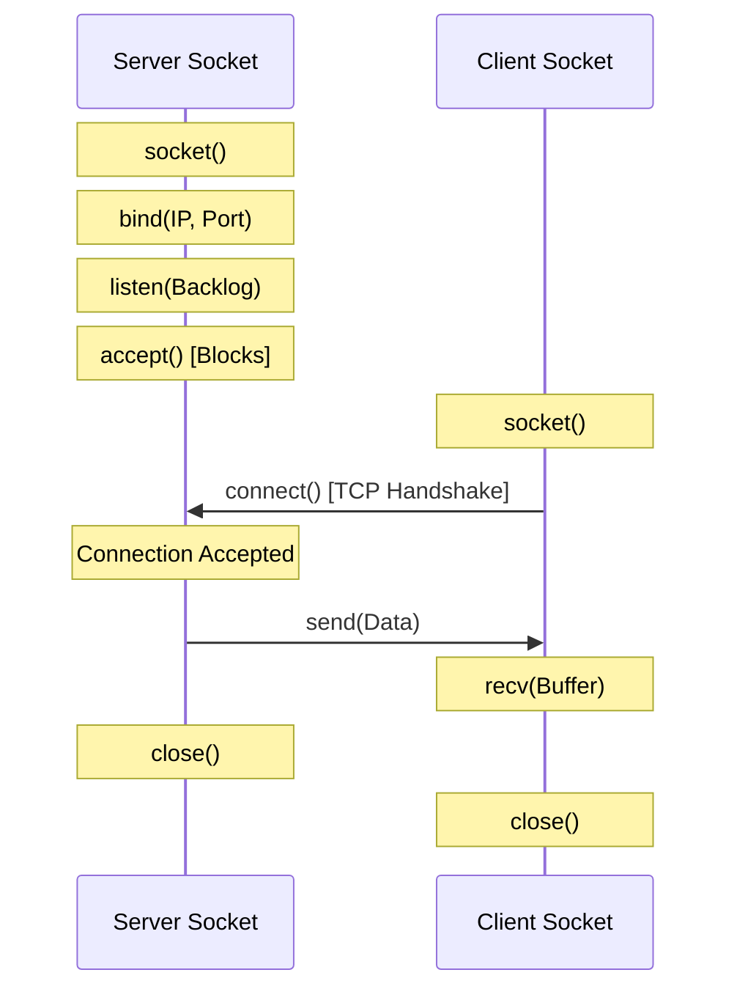
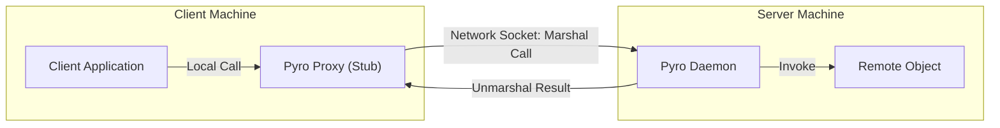
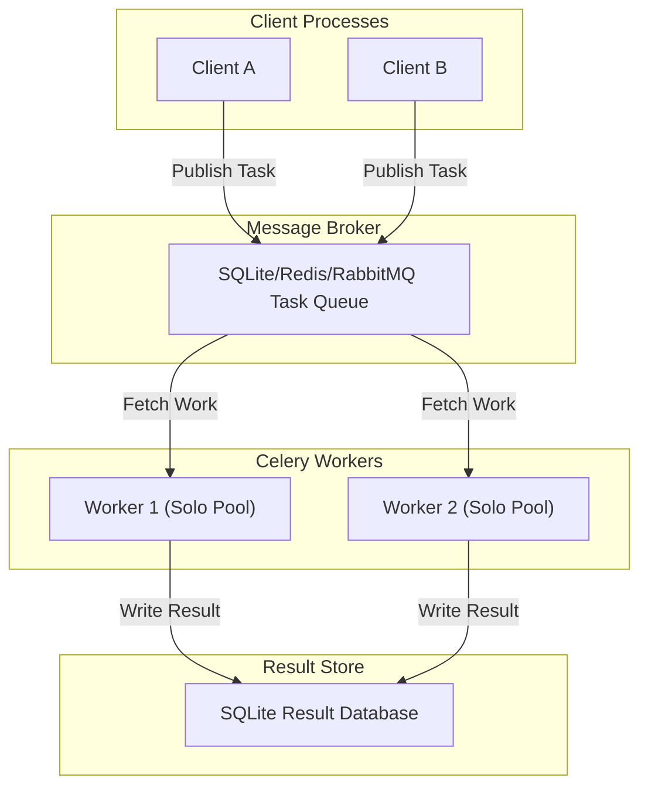

# Chapter 06: Distributed Architectures and Task Queues

## Overview

Welcome to the **Parallel and Distributed Computing (PDC)** documentation for Chapter 06. This chapter explores **Distributed Systems**, progressing from raw network socket programming up to higher-level abstractions: **Remote Method Invocation (RMI)** via Pyro5, and **Distributed Task Queues** using Celery.

In previous chapters, we analyzed parallel programming models constrained to single-node environments (sharing memory or CPU cores on a single OS). In Chapter 6, we design architectures that span across independent systems over network boundaries. We focus on message-passing designs, remote service execution, and asynchronous message broker queues.

This guide is strictly divided into two sections: **Part 1** covers the theoretical computer science models governing network sockets, remote objects, and distributed worker topologies. **Part 2** provides comprehensive breakdowns of the empirical Python implementations.

---

## Table of Contents

### Part 1: Theoretical Foundations
1. [Network Socket Programming Model](#1-network-socket-programming-model)
    - [TCP/IP Sockets and State Machine](#tcpip-sockets-and-state-machine)
    - [Data Serialization and Buffer Management](#data-serialization-and-buffer-management)
2. [Remote Method Invocation (RMI) via Pyro5](#2-remote-method-invocation-rmi-via-pyro5)
    - [The Proxy Pattern and Location Transparency](#the-proxy-pattern-and-location-transparency)
    - [Name Servers, Daemons, and Object Lifecycle](#name-servers-daemons-and-object-lifecycle)
    - [Multi-Hop Chain Topologies](#multi-hop-chain-topologies)
3. [Distributed Task Queues (Celery)](#3-distributed-task-queues-celery)
    - [The Producer-Broker-Consumer Model](#the-producer-broker-consumer-model)
    - [Worker Pools and Result Backends](#worker-pools-and-result-backends)

### Part 2: Practical Implementation
4. [Implementation Breakdown & Outputs](#4-implementation-breakdown--outputs)
    - [Low-Level Socket Communication (`socket/`)](#low-level-socket-communication)
    - [Remote Method Invocation (`Pyro4/First Example/`)](#remote-method-invocation)
    - [Chain Routing Topologies (`Pyro4/Second Example/`)](#chain-routing-topologies)
    - [Distributed Task Queueing (`Celery/`)](#distributed-task-queueing)
5. [Execution Guide](#5-execution-guide)

---

# PART 1: THEORETICAL FOUNDATIONS

## 1. Network Socket Programming Model

At the lowest level of network computing, processes communicate using **Sockets**. A socket is one endpoint of a two-way communication link between two programs running on the network.

### TCP/IP Sockets and State Machine

A socket is bound to a specific IP address and a Port number. For reliable, ordered, and error-checked delivery of a stream of octets (bytes), we utilize the **Transmission Control Protocol (TCP)**.



The server instantiates a passive socket, binds it to a local port, listens for incoming connections, and blocks on `accept()`. The client instantiates an active socket and attempts to `connect()`. Once established, data is exchanged as raw bytes, and the sockets are closed.

### Data Serialization and Buffer Management

Network communication transmits streams of raw bytes. To exchange complex structures (such as text, numbers, or objects), programs must serialize the data to a byte representation (e.g., ASCII encoding or pickle format) on transmission, and deserialize it on reception. 

Furthermore, network calls like `recv(1024)` are constrained by the maximum buffer size. Applications must manage chunking and handle cases where messages are fragmented or concatenated at the TCP socket layer.

## 2. Remote Method Invocation (RMI) via Pyro5

Writing low-level socket protocol logic for complex distributed operations is error-prone. **Remote Method Invocation (RMI)** abstracts this complexity by allowing a program to execute methods on objects residing on remote virtual machines.

### The Proxy Pattern and Location Transparency

Pyro5 (Python Remote Objects) implements RMI using the **Proxy Pattern**. The client does not interact with the network directly. Instead, it calls methods on a local **Proxy Object** (sometimes called a Stub). The proxy serializes the call parameters (marshalling), transmits them over network sockets to the remote server, waits for the response, deserializes the result (unmarshalling), and returns it to the client.



This architecture achieves **Location Transparency**: the client interacts with the remote service as if it were a local object residing in the same memory partition.

### Name Servers, Daemons, and Object Lifecycle

To coordinate connections, Pyro5 uses a directory service called the **Name Server**:
1. **Server Registration:** The remote server starts a `Daemon`. It registers its Python objects with the daemon, obtaining a Unique Resource Identifier (URI) containing the IP and port. It then registers a human-readable alias (e.g., `"server"`) mapped to this URI in the Name Server.
2. **Client Resolution:** When a client instantiates `Proxy("PYRONAME:server")`, it queries the Name Server to resolve the alias to the URI. Once resolved, the client connects directly to the server's daemon.

### Multi-Hop Chain Topologies

RMI systems can be composed into complex routing systems, such as **Chain Topologies**. In this configuration, the client makes a call to Server A. Server A acts as a client to Server B, invoking a remote method on it, which in turn calls Server C. The execution winds through the nodes and unwinds back to the caller, showcasing distributed orchestration.

## 3. Distributed Task Queues (Celery)

When scaling systems, synchronous RMI can bottleneck: if the remote server takes too long to process a task, the client remains blocked. **Distributed Task Queues** decouple execution using asynchronous task scheduling.

### The Producer-Broker-Consumer Model

Celery implements this asynchronous concurrency model:



- **Producer:** The client application that schedules a task (e.g., `add.delay(2, 3)`). Instead of running it locally, it serializes the arguments and pushes a message to the broker.
- **Message Broker:** A store (e.g., RabbitMQ, Redis, or an SQL database like SQLite) that queues incoming task messages safely.
- **Consumer (Worker):** Independent background daemon processes that continuously poll the broker for tasks, execute them, and store the output.

### Worker Pools and Result Backends

Once a task is complete, the worker writes the return status and output values to a **Result Backend**. The producer client can then fetch the result asynchronously or query its status using the task's unique UUID. 

On operating systems like Windows, Celery workers require explicit concurrency configuration (e.g., `--pool=solo`) to handle process initialization boundaries correctly.

---
---

# PART 2: PRACTICAL IMPLEMENTATION

## 4. Implementation Breakdown & Outputs

The `Chapter06` workspace contains recipes utilizing raw sockets, Pyro5 name services, and SQL-backed Celery queues.

### Low-Level Socket Communication

#### Time Connection Server
**Files:** `socket/server.py` and `socket/client.py`

The server binds to port `9999` and listens. Upon receiving a connection, it serializes the local server time to an ASCII byte string, transmits it, and closes the connection.

**Server Code:**
```python
import socket
import time

serversocket = socket.socket(socket.AF_INET, socket.SOCK_STREAM)
host = socket.gethostname()
port = 9999
serversocket.bind((host, port))
serversocket.listen(5)

while True:	
    clientsocket, addr = serversocket.accept()
    print("Connected with addr: %s" % str(addr))
    currentTime = time.ctime(time.time()) + "\r\n"
    clientsocket.send(currentTime.encode('ascii'))
    clientsocket.close()
```

**Client Code:**
```python
import socket

s = socket.socket(socket.AF_INET, socket.SOCK_STREAM)
host = socket.gethostname()
port = 9999
s.connect((host, port))
tm = s.recv(1024)
s.close()
print("Time connection server: %s" % tm.decode('ascii'))
```

**Expected Client Output:**
```text
Time connection server: Thu Jun  4 20:45:00 2026
```

---

#### File Transfer Server
**Files:** `socket/server2.py` and `socket/client2.py`

This program reads a text file (`mytext.txt`) on the server, streams its byte contents across a TCP connection, and writes it to a file (`received.txt`) on the client machine.

**Expected Server Output:**
```text
Server listening...
Got connection from ('127.0.0.1', 54321)
Sent file data successfully.
```

**Expected Client Output:**
```text
Successfully received the file data.
```

---

### Remote Method Invocation

#### Welcome Message Server
**Files:** `Pyro4/First Example/pyro_server.py` and `Pyro4/First Example/pyro_client.py`

This implementation uses Pyro5 to register a `Server` object in the name server. The client invokes `welcomeMessage` remotely, passing a string argument across processes.

**Server Registration Snippet:**
```python
import Pyro5.api

class Server(object):
    @Pyro5.api.expose
    def welcomeMessage(self, name):
        return ("Hi welcome " + str(name))

server = Server()
daemon = Pyro5.api.Daemon()             
ns = Pyro5.api.locate_ns()
uri = daemon.register(server)  
ns.register("server", uri)   
daemon.requestLoop()                   
```

**Client Execution Snippet:**
```python
import Pyro5.api

name = "Ezaz"
server = Pyro5.api.Proxy("PYRONAME:server")    
print(server.welcomeMessage(name))
```

**Expected Client Output:**
```text
Hi welcome Ezaz
```

---

### Chain Routing Topologies

#### 3-Server Ring Routing
**Files:** `Pyro4/Second Example/server_chain_1.py`, `server_chain_2.py`, `server_chain_3.py`, and `client_chain.py`

In this example, three servers are started. The client calls Server 1. Server 1 queries Server 2, Server 2 queries Server 3, and Server 3 queries Server 1. This creates a multi-hop execution chain that logs the path traversal.

**Expected Client Output:**
```text
Calling chain starting at Server 1...
Chain response path: ['Server 1', 'Server 2', 'Server 3', 'Server 1']
```

---

### Distributed Task Queueing

#### Celery Asynchronous Calculations
**Files:** `Celery/addTask.py` and `Celery/addTask_main.py`

We instantiate Celery configured to use a local SQLite database file (`celerydb.sqlite`) as both the broker queue and the result store. The client schedules addition operations, and a worker process consumes and executes them.

**Task Definition:**
```python
import os
from celery import Celery

broker_url = 'sqla+sqlite:///celerydb.sqlite'
backend_url = 'db+sqlite:///celerydb.sqlite'
app = Celery('addTask', broker=broker_url, backend=backend_url)

@app.task
def add(x, y):
    return x + y
```

**Client Invocation:**
```python
from addTask import add
import time

result = add.delay(4, 4)
print(f"Task status: {result.status}")

while not result.ready():
    time.sleep(0.5)

print(f"Task result value: {result.result}")
```

**Expected Worker Log Output:**
```text
[info] Task addTask.add[uuid] received
[info] Task addTask.add[uuid] succeeded in 0.015s: 8
```

**Expected Client Output:**
```text
Task status: PENDING
Task result value: 8
```

---

## 5. Execution Guide

Before running any recipes, activate the local environment (`.venv`) and navigate to the directory of the respective recipe.

### Low-Level Sockets
1. **Start Server:**
   ```cmd
   python Chapter06/socket/server.py
   ```
2. **Run Client:**
   ```cmd
   python Chapter06/socket/client.py
   ```

### Pyro5 RMI
1. **Start Name Server:**
   ```cmd
   python -m Pyro5.nameserver
   ```
2. **Start Server Daemon:**
   ```cmd
   python "Chapter06/Pyro4/First Example/pyro_server.py"
   ```
3. **Execute Client:**
   ```cmd
   python "Chapter06/Pyro4/First Example/pyro_client.py"
   ```

### Chain Topology
1. Ensure the Name Server is running (`python -m Pyro5.nameserver`).
2. Start the three chain nodes in separate terminals:
   ```cmd
   python "Chapter06/Pyro4/Second Example/server_chain_1.py"
   python "Chapter06/Pyro4/Second Example/server_chain_2.py"
   python "Chapter06/Pyro4/Second Example/server_chain_3.py"
   ```
3. Run the client:
   ```cmd
   python "Chapter06/Pyro4/Second Example/client_chain.py"
   ```

### Celery Workers
1. **Start Worker (Windows requires pool=solo configuration):**
   ```cmd
   cd Chapter06/Celery
   ../../.venv/Scripts/celery.exe -A addTask worker --loglevel=info --pool=solo
   ```
2. **Dispatch Task Payload:**
   ```cmd
   python Chapter06/Celery/addTask_main.py
   ```
