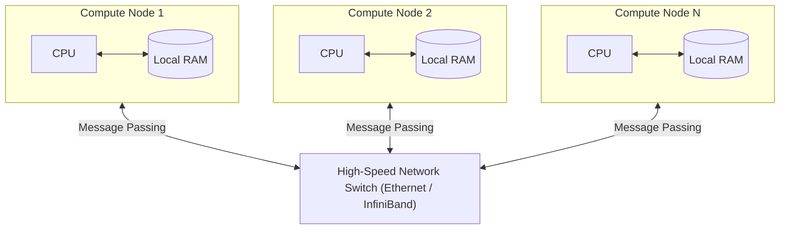
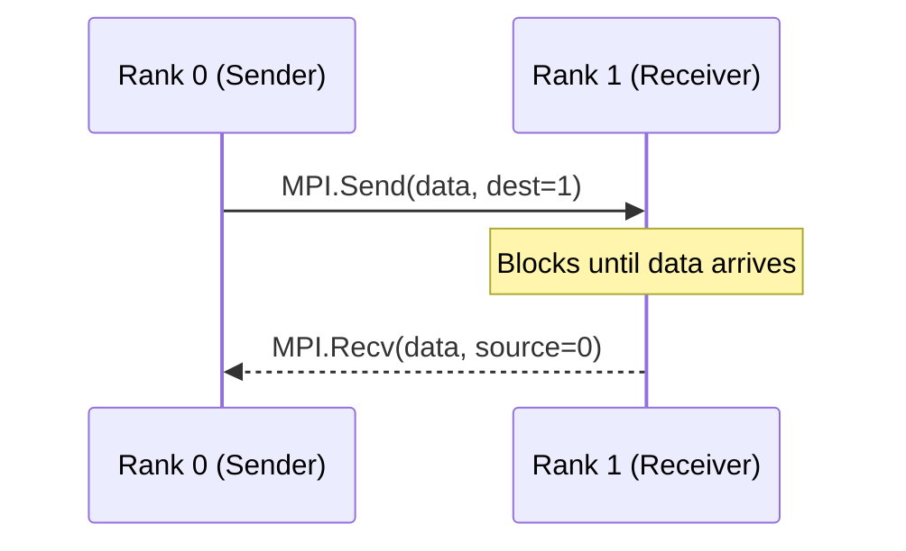
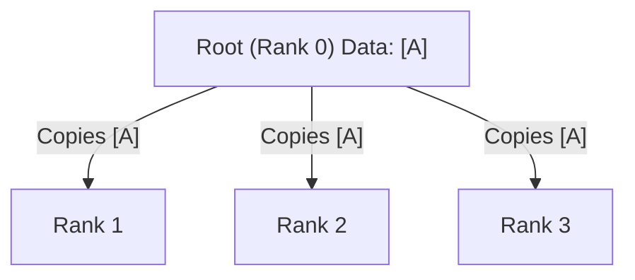
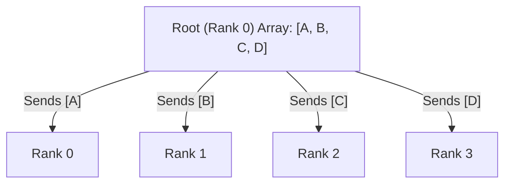

# Chapter 04: Distributed Memory and Message Passing Interface (MPI)

## Overview

Welcome to the **Parallel and Distributed Computing (PDC)** documentation for Chapter 04. While previous chapters focused on Shared Memory (Threading) and Multi-Core parallelism (Multiprocessing) confined within a single physical machine, this chapter ascends to the domain of **Distributed Computing**.

Here, we explore the **Message Passing Interface (MPI)** using the `mpi4py` library. MPI enables high-performance computing across vast clusters of distinct physical machines, interconnected via local area networks (LAN) or sophisticated switch fabrics (e.g., InfiniBand). 

This guide is strictly divided into two sections: **Part 1** covers the theoretical computer science concepts behind distributed memory, network topologies, and collective communication algorithms. **Part 2** provides comprehensive breakdowns of empirical Python code implementations.

---

## Table of Contents

### Part 1: Theoretical Foundations
1. [Distributed Memory Architectures](#1-distributed-memory-architectures)
    - [The Cluster Computing Paradigm](#the-cluster-computing-paradigm)
    - [Network Topologies and Interconnects](#network-topologies-and-interconnects)
2. [The Message Passing Interface (MPI) Standard](#2-the-message-passing-interface-mpi-standard)
    - [Communicators, Ranks, and Size](#communicators-ranks-and-size)
    - [Serialization overhead](#serialization-overhead)
3. [Core Communication Modalities](#3-core-communication-modalities)
    - [Point-to-Point Communication](#point-to-point-communication)
    - [Collective Communication](#collective-communication)
4. [Deadlocks in Distributed Systems](#4-deadlocks-in-distributed-systems)
5. [Virtual Topologies](#5-virtual-topologies)

### Part 2: Practical Implementation
6. [Implementation Breakdown & Outputs](#6-implementation-breakdown--outputs)
    - [Basic MPI Initialization (`helloworld_MPI.py`)](#basic-mpi-initialization)
    - [Point-to-Point (`pointToPointCommunication.py`)](#point-to-point)
    - [Broadcasting (`broadcast.py`)](#broadcasting)
    - [Scattering (`scatter.py`)](#scattering)
    - [Gathering (`gather.py`)](#gathering)
    - [All-to-All (`alltoall.py`)](#all-to-all)
    - [Reduction Algorithms (`reduction.py`)](#reduction-algorithms)
    - [Deadlocks (`deadLockProblems.py`)](#deadlocks)
    - [Cartesian Topologies (`virtualTopology.py`)](#cartesian-topologies)
7. [Execution Guide](#7-execution-guide)

---

# PART 1: THEORETICAL FOUNDATIONS

## 1. Distributed Memory Architectures

In a true distributed system, processing nodes do not share physical memory. Node A cannot directly read a variable located in the RAM of Node B.

### The Cluster Computing Paradigm



To collaborate on a computational workload, Node A must physically serialize its data, transmit it across the network hardware, and Node B must deserialize it. This is significantly slower than shared-memory IPC, meaning algorithms must be heavily optimized to minimize network communication overhead.

### Network Topologies and Interconnects
The physical wiring of a cluster impacts latency. Standard configurations include Star, Mesh, Torus, and Hypercube topologies. Understanding these constraints is crucial when designing communication patterns.

## 2. The Message Passing Interface (MPI) Standard

MPI is a standardized and portable message-passing standard designed to function on parallel computing architectures. `mpi4py` provides Python bindings for the underlying C/C++ MPI implementations (like OpenMPI or MPICH).

### Communicators, Ranks, and Size
- **Communicator:** An object connecting a group of processes. The default communicator encompassing every spawned process is `MPI.COMM_WORLD`.
- **Rank:** The unique integer identifier assigned to each process within a communicator. If you spawn 4 processes, their ranks are $0, 1, 2, 3$. Process $0$ is traditionally designated as the "Master" or "Root" node.
- **Size:** The total number of processes in the communicator.

### Serialization overhead
`mpi4py` distinguishes between uppercase and lowercase methods (e.g., `send()` vs `Send()`).
- **Lowercase (`send`, `recv`):** Uses Python's `pickle` module under the hood to serialize generic Python objects (lists, dictionaries, custom objects). It is flexible but slow.
- **Uppercase (`Send`, `Recv`):** Bypasses `pickle` entirely to directly transmit contiguous memory buffers (like NumPy arrays) via C-level memory pointers. It is incredibly fast but strictly typed.

## 3. Core Communication Modalities

### Point-to-Point Communication
The most granular form of communication. One explicit process sends a message to exactly one explicit receiving process.


- **Blocking:** The sender waits until the data is safely copied out of its buffer.
- **Non-Blocking (`Isend`, `Irecv`):** Returns immediately, allowing the sender to perform other calculations while the network hardware transfers the data asynchronously.

### Collective Communication
Operations that involve *every* process within a communicator simultaneously.

#### Broadcast (Bcast)
The Root node sends an identical copy of a single variable to all other nodes in the communicator.



#### Scatter
The Root node takes a contiguous array (e.g., `[A, B, C, D]`) and slices it into chunks. It sends chunk 1 to Rank 0, chunk 2 to Rank 1, and so on.



#### Gather
The exact inverse of Scatter. Every node sends its individual data payload back to the Root node, which concatenates them into a single ordered array.

#### All-to-All
Every node acts as both a Scatter root and a Gather root. Every process receives a chunk of data from every other process. This is the most network-intensive collective operation and can easily saturate network bandwidth.

#### Reduction (Reduce)
Nodes do not just gather data; they apply a mathematical operation (Sum, Max, Min, Product) across the data as it travels across the network. For example, calculating the global sum of an array distributed across 1000 nodes.

## 4. Deadlocks in Distributed Systems

A Deadlock occurs when two or more processes are permanently blocked, waiting on each other to release resources or send messages. 


In Point-to-Point communication, if Rank 0 executes a blocking `recv()` waiting for Rank 1, but Rank 1 executes a blocking `recv()` waiting for Rank 0, both processes will hang infinitely. Proper algorithmic sequencing is paramount.

## 5. Virtual Topologies

While `MPI.COMM_WORLD` treats all processes as a flat 1D array, many physical simulations (like fluid dynamics or thermal modeling) rely on 2D or 3D grids. MPI allows the creation of Cartesian Virtual Topologies, mapping linear ranks to multi-dimensional coordinate systems (e.g., mapping 16 ranks into a 4x4 grid). This simplifies calculating nearest-neighbor communication vectors.

---
---

# PART 2: PRACTICAL IMPLEMENTATION

## 6. Implementation Breakdown & Outputs

The `Chapter04` directory contains scripts proving these communication modalities. 

### Basic MPI Initialization
**File:** `helloworld_MPI.py`

**Code Snippet:**
```python
from mpi4py import MPI

comm = MPI.COMM_WORLD
rank = comm.Get_rank()
size = comm.Get_size()

print(f"Hello world from process {rank} of {size}")
```
**Expected Output (Running with 4 processes):**
```text
Hello world from process 0 of 4
Hello world from process 2 of 4
Hello world from process 3 of 4
Hello world from process 1 of 4
```
*(Notice the non-deterministic output order, as each independent process reaches the print statement at slightly different microseconds).*

---

### Point-to-Point
**File:** `pointToPointCommunication.py`

**Code Snippet:**
```python
from mpi4py import MPI

comm = MPI.COMM_WORLD
rank = comm.rank

if rank == 0:
    data = {'a': 7, 'b': 3.14}
    comm.send(data, dest=1, tag=11)
    print(f"Process {rank} sent data: {data}")
elif rank == 1:
    data = comm.recv(source=0, tag=11)
    print(f"Process {rank} received data: {data}")
```
**Expected Output:**
```text
Process 0 sent data: {'a': 7, 'b': 3.14}
Process 1 received data: {'a': 7, 'b': 3.14}
```
*(Demonstrates explicit targeted communication using message tags to ensure proper routing).*

---

### Broadcasting
**File:** `broadcast.py`

**Code Snippet:**
```python
from mpi4py import MPI

comm = MPI.COMM_WORLD
rank = comm.Get_rank()

if rank == 0:
    variable_to_share = 100
else:
    variable_to_share = None

variable_to_share = comm.bcast(variable_to_share, root=0)
print(f"Process {rank} has variable: {variable_to_share}")
```
**Expected Output:**
```text
Process 0 has variable: 100
Process 1 has variable: 100
Process 2 has variable: 100
Process 3 has variable: 100
```
*(Demonstrates collective synchronization; the variable is pushed from the root to all sibling nodes).*

---

### Scattering
**File:** `scatter.py`

**Code Snippet:**
```python
from mpi4py import MPI

comm = MPI.COMM_WORLD
rank = comm.Get_rank()
size = comm.Get_size()

if rank == 0:
    data = [(i+1)**2 for i in range(size)]
    print(f"Root generating data: {data}")
else:
    data = None

data = comm.scatter(data, root=0)
print(f"Process {rank} received data: {data}")
```
**Expected Output:**
```text
Root generating data: [1, 4, 9, 16]
Process 0 received data: 1
Process 1 received data: 4
Process 2 received data: 9
Process 3 received data: 16
```

---

### Gathering
**File:** `gather.py`

**Code Snippet:**
```python
from mpi4py import MPI

comm = MPI.COMM_WORLD
rank = comm.Get_rank()

data = rank * 10
print(f"Process {rank} holds data: {data}")

gathered_data = comm.gather(data, root=0)

if rank == 0:
    print(f"Root gathered data: {gathered_data}")
```
**Expected Output:**
```text
Process 0 holds data: 0
Process 1 holds data: 10
Process 2 holds data: 20
Process 3 holds data: 30
Root gathered data: [0, 10, 20, 30]
```

---

### All-to-All
**File:** `alltoall.py`

**Code Snippet:**
```python
from mpi4py import MPI
import numpy as np

comm = MPI.COMM_WORLD
rank = comm.Get_rank()
size = comm.Get_size()

senddata = np.arange(size, dtype=int) * (rank + 1)
recvdata = np.empty(size, dtype=int)

comm.Alltoall(senddata, recvdata)

print(f"Rank {rank} send: {senddata} | recv: {recvdata}")
```
**Expected Output:**
```text
Rank 0 send: [0 0 0 0] | recv: [0 1 2 3]
Rank 1 send: [0 1 2 3] | recv: [0 1 4 9]
...
```
*(A highly complex matrix transposition across the network).*

---

### Reduction Algorithms
**File:** `reduction.py`

**Code Snippet:**
```python
from mpi4py import MPI
import numpy as np

comm = MPI.COMM_WORLD
rank = comm.Get_rank()

value = np.array([rank], dtype=float)
sum_val = np.array([0.0], dtype=float)

comm.Reduce(value, sum_val, op=MPI.SUM, root=0)

if rank == 0:
    print(f"Global Sum is: {sum_val[0]}")
```
**Expected Output (With 4 Processes):**
```text
Global Sum is: 6.0
```
*(Calculated internally by the network as $0 + 1 + 2 + 3 = 6$, saving massive data aggregation overhead).*

---

### Deadlocks
**File:** `deadLockProblems.py`

**Code Snippet:**
```python
from mpi4py import MPI

comm = MPI.COMM_WORLD
rank = comm.rank

# Both processes attempt to receive BEFORE sending.
# This results in an infinite hang.
if rank == 0:
    data_recv = comm.recv(source=1, tag=2)
    comm.send(100, dest=1, tag=1)
elif rank == 1:
    data_recv = comm.recv(source=0, tag=1)
    comm.send(200, dest=0, tag=2)
```
*(This script will hang indefinitely in your terminal until killed via Ctrl+C, proving the danger of cyclic wait constraints).*

---

### Cartesian Topologies
**File:** `virtualTopology.py`

**Code Snippet:**
```python
from mpi4py import MPI

comm = MPI.COMM_WORLD
rank = comm.rank

# Create a 2x2 Cartesian Grid Topology
cartesian_communicator = comm.Create_cart(dims=[2, 2], periods=[False, False], reorder=False)
coords = cartesian_communicator.Get_coords(rank)

print(f"Rank {rank} is located at grid coordinates: {coords}")
```
**Expected Output (With 4 Processes):**
```text
Rank 0 is located at grid coordinates: [0, 0]
Rank 1 is located at grid coordinates: [0, 1]
Rank 2 is located at grid coordinates: [1, 0]
Rank 3 is located at grid coordinates: [1, 1]
```

---

## 7. Execution Guide
Because MPI spans independent processes natively, standard `python script.py` execution is insufficient. To execute these scripts across a local emulated cluster, use the `mpiexec` or `mpirun` command-line utility, specifying the number of concurrent execution nodes with the `-n` flag.

Ensure you are navigated inside the `Chapter04` directory:

```bash
mpiexec -n 4 python helloworld_MPI.py
mpiexec -n 2 python pointToPointCommunication.py
mpiexec -n 4 python broadcast.py
mpiexec -n 4 python scatter.py
mpiexec -n 4 python gather.py
mpiexec -n 4 python alltoall.py
mpiexec -n 4 python reduction.py
mpiexec -n 4 python virtualTopology.py
```
*(Note: Attempting to run `deadLockProblems.py` will result in your terminal freezing to demonstrate a deadlock).*
